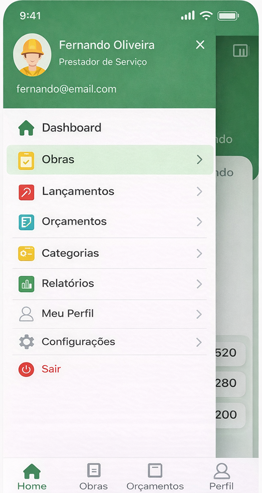
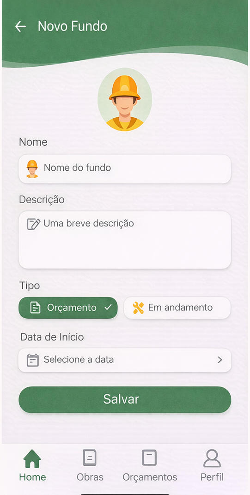
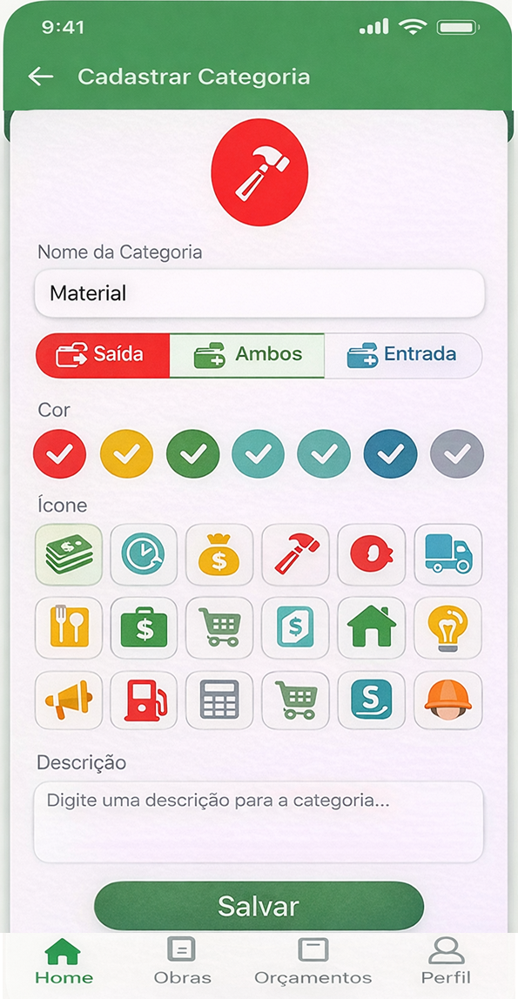
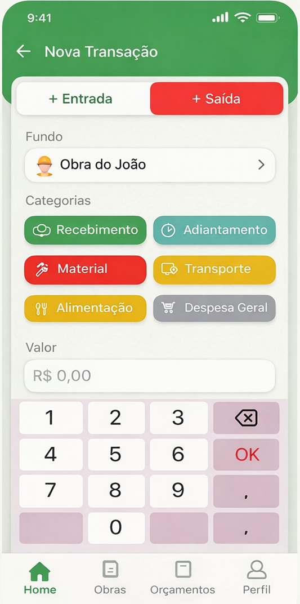

# GS Financeira

Aplicativo Expo + React Native para controle financeiro e orcamentos de prestadores de servico. O foco do produto e oferecer uma experiencia simples, adaptiva e step-by-step para profissionais como pedreiros, eletricistas, pintores, encanadores e autonomos em geral.

## Visao do produto

O sistema gira em torno do fundo de custo, que representa uma obra, cliente, reforma, manutencao ou projeto. A partir dele o usuario consegue:

- registrar entradas e saidas diarias
- separar movimentacoes por categoria
- acompanhar saldo por periodo e por fundo
- montar orcamentos com servicos e materiais
- calcular totais automaticamente
- preparar a base para gerar PDF e compartilhar no WhatsApp

## Preview








## Fluxo principal

1. Login ou cadastro do prestador de servico.
2. Criacao e edicao do perfil da empresa e da conta.
3. Criacao do primeiro fundo de custo.
4. Registro de entradas e saidas vinculadas ao fundo.
5. Consulta de resumo, relatorios e saldos.
6. Criacao de orcamentos com servicos e materiais.

## Ambiente

O projeto agora possui um arquivo local `.env` e um modelo versionado `.env.example`.

Credenciais padrao de desenvolvimento:

- E-mail: `admin@gmail.com`
- Senha: `12345678`

Variaveis principais:

- `EXPO_PUBLIC_DEFAULT_AUTH_EMAIL`
- `EXPO_PUBLIC_DEFAULT_AUTH_PASSWORD`
- `EXPO_PUBLIC_APP_URL_LOCAL`
- `EXPO_PUBLIC_APP_URL_DNS`
- `EXPO_PUBLIC_GOOGLE_REDIRECT_URL_LOCAL`
- `EXPO_PUBLIC_GOOGLE_REDIRECT_URL_DNS`
- `EXPO_PUBLIC_GOOGLE_CLIENT_ID`
- `GOOGLE_CLIENT_ID`
- `GOOGLE_SECRET_KEY`

Regra importante:

- Variaveis com prefixo `EXPO_PUBLIC_` podem ser lidas pelo app cliente.
- Variaveis sem esse prefixo devem ficar reservadas para backend/API futura.

## Sessao atual

Nesta fase o projeto usa sessao em memoria para refinamento do fluxo de login.

- login local validado com credenciais do `.env`
- sessao global via provider React
- redirecionamento automatico para o dashboard apos login
- protecao de `dashboard` e `perfil` quando o usuario nao estiver autenticado
- logout funcional retornando para a tela inicial

Essa sessao ainda nao persiste apos recarregar o app. A persistencia sera uma etapa natural quando conectarmos a API real.

## Estrutura de diretorios

### `app/`
Contem as telas e rotas principais do aplicativo usando Expo Router.

- `index.tsx`: tela inicial de login.
- `cadastro.tsx`: tela de cadastro do usuario.
- `dashboard.tsx`: tela inicial do painel com atalhos e cards iniciais.
- `perfil.tsx`: modulo de perfil com abas internas de empresa, conta e preferencias.
- `_layout.tsx`: configuracao raiz de navegacao, tema e status bar.

### `components/`
Componentes reutilizaveis da interface.

- `app-header.tsx`: topo verde padronizado usado nas telas atuais.

### `providers/`
Providers globais da aplicacao.

- `session-provider.tsx`: estado global da sessao autenticada.

### `hooks/`
Hooks utilitarios compartilhados pela aplicacao.

- `use-color-scheme.ts`: leitura do tema do dispositivo.
- `use-color-scheme.web.ts`: suporte equivalente para web.
- `use-session.ts`: acesso ao estado global da sessao.

### `services/`
Servicos simples de integracao usados pela interface.

- `auth.ts`: login local, leitura das credenciais padrao e configuracao do Google Auth.
- `viacep.ts`: consulta de endereco via ViaCEP para auto preenchimento de CEP.

### `mocks/`
Pasta unica para dados mocados usados no desenvolvimento visual.

- `dashboard.ts`: arrays e objetos iniciais usados nas telas de dashboard e perfil.

### `types/`
Tipagens centrais do projeto para manter consistencia entre mock, tela e futura API.

- `mock-types.ts`: tipos base dos dados mocados atuais.
- `auth-types.ts`: tipos da autenticacao local e da sessao.

### `utils/`
Funcoes auxiliares para comportamento de formulario e tratamento visual dos dados.

- `formatters.ts`: mascaras de telefone, CEP e CNPJ.
- `validators.ts`: validacao local de CNPJ.

### `assets/`
Arquivos visuais e icones do app.

- `images/icon.png`: icone principal do aplicativo.
- `images/splash-icon.png`: imagem usada na splash screen.
- `images/android-icon-*`: arquivos do icone adaptativo Android.
- `images/favicon.png`: favicon da versao web.

### `docs/`
Documentacao funcional e de produto usada como referencia do projeto.

- `plano.md`: regras de negocio, modulos, MVP e roadmap.
- `reumo.md`: resumo funcional do sistema e da modelagem inicial.

### `preview/`
Referencias visuais das primeiras telas e da direcao de interface.

- `mod/start/2-login-app.png`: referencia da tela de login.
- `mod/start/3-cadastro.png`: referencia da tela de cadastro.
- `mod/start/4-dashboard.png`: referencia do dashboard/menu.
- `mod/2-perfil/*.png`: referencias do modulo de perfil em tres etapas.

### Arquivos de configuracao na raiz

- `app.json`: configuracao do Expo, icones, splash e plugins.
- `package.json`: scripts e dependencias do projeto.
- `tsconfig.json`: configuracao TypeScript e alias `@/*`.
- `eslint.config.js`: regras de lint.
- `.env.example`: modelo oficial das variaveis de ambiente.

## Convencao de mocks

Enquanto a API nao estiver pronta, toda tela nova deve seguir este padrao:

1. Criar a tipagem em `types/`.
2. Criar os dados mocados em `mocks/`.
3. Consumir esses dados na tela, sem deixar arrays hardcoded dentro do componente.

Esse fluxo deixa o projeto mais limpo agora e facilita a troca futura de mocks por dados vindos de API.

## Regras atuais de formulario

- `telefone`, `CEP` e `CNPJ` usam mascara visual.
- `CEP` tenta preencher endereco automaticamente via ViaCEP ao atingir 8 digitos.
- `CNPJ` possui validacao local para impedir formato numerico invalido.
- O modulo `Perfil` usa progresso por aba para refletir o andamento do preenchimento.

## Estado atual

O projeto ja possui a base das primeiras telas, header visual padronizado, estrutura inicial de mocks, login local via `.env`, sessao global em memoria e o modulo de perfil com as abas `Dados da Empresa`, `Conta` e `Preferencias`. As proximas etapas do fluxo de negocio incluem fundos de custo, lancamentos, categorias, relatorios e orcamentos.

## Como executar

```bash
npm install
npm run start
```

Atalhos uteis:

- `npm run android`
- `npm run ios`
- `npm run web`
- `npm run lint`

## Diretrizes de interface

- Layout adaptivo para telas pequenas e telas maiores.
- Aproveitar toda a largura disponivel sem sobras laterais desnecessarias.
- Evitar cortes horizontais.
- Priorizar poucas informacoes por tela.
- Manter o topo verde simples como padrao visual das telas.
- Padronizar cards e areas de formulario com fundo branco.
